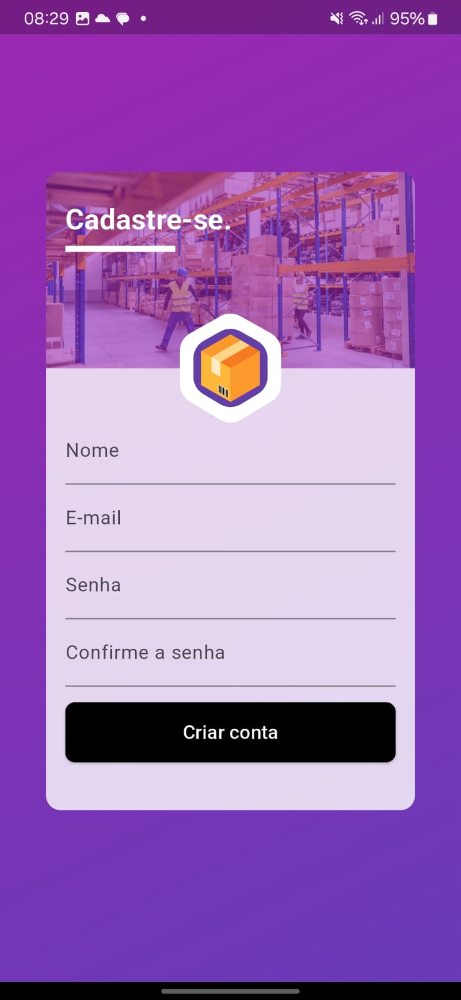
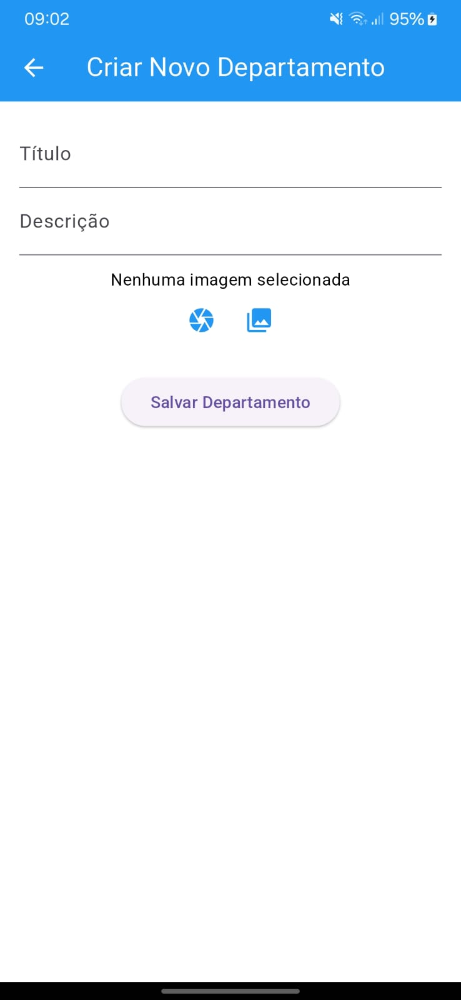
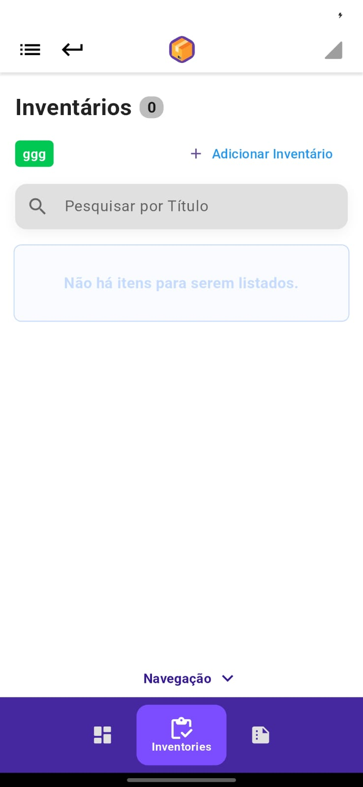
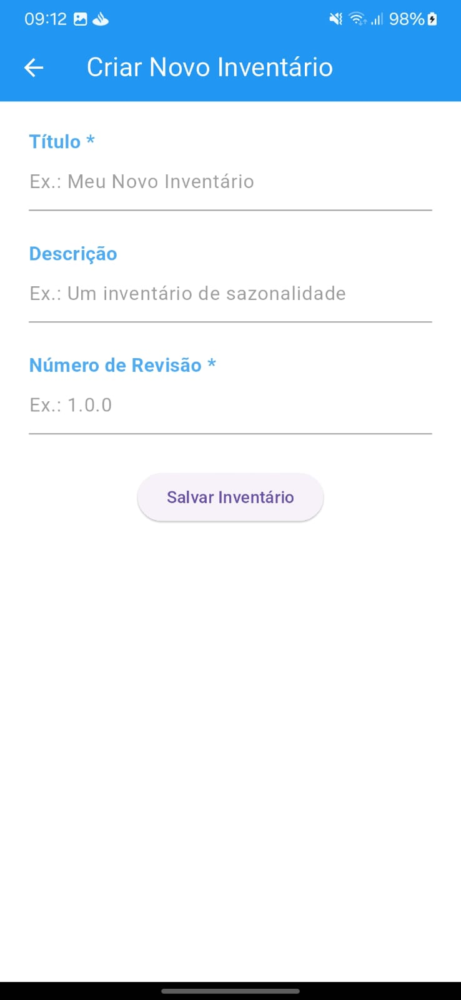
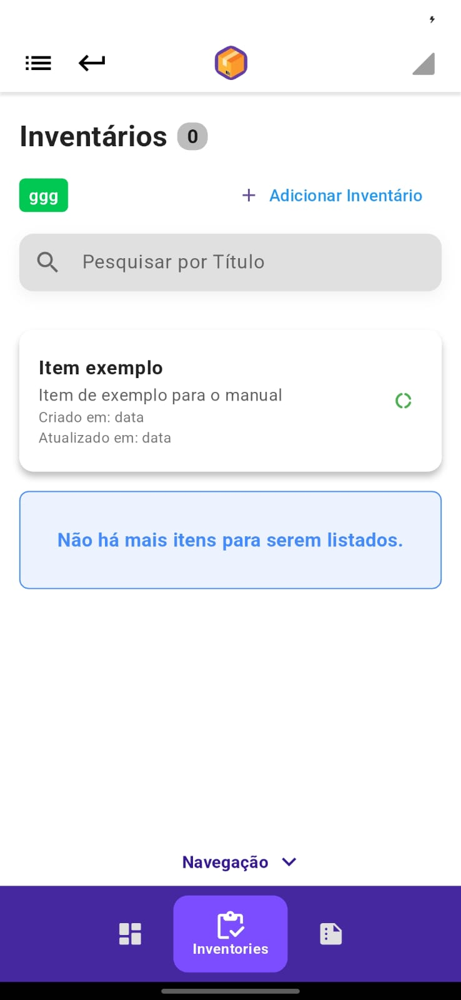
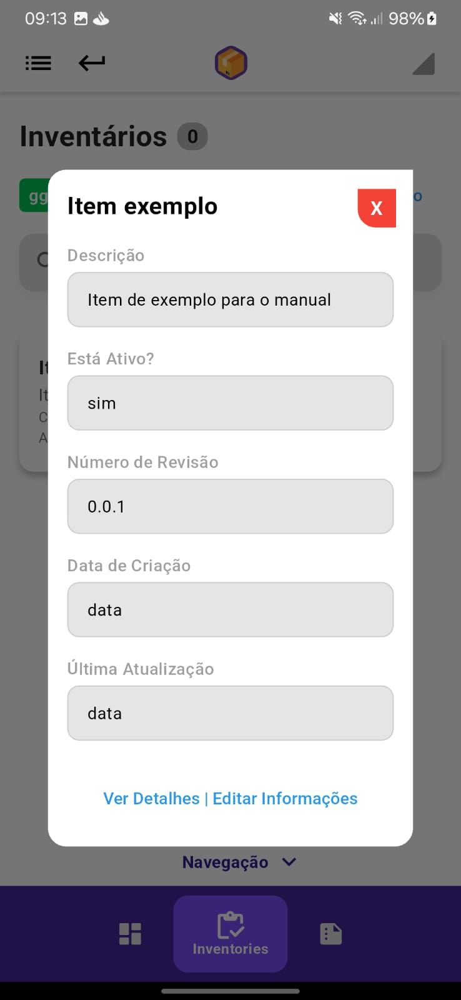

# 📌 Inventory Platform

Este é um aplicativo web e mobile para o gerenciamento de inventário, desenvolvido com Flutter. A aplicação foi projetada para facilitar o controle de itens em estoque, oferecendo múltiplas opções para captura de códigos de inventário, incluindo:

- ✍️ **Captura Manual**: Inserção direta de códigos.
- 📷 **Barcode**: Leitura de códigos de barras para identificar itens rapidamente.
- 🔍 **OCR**: Reconhecimento de texto através de imagem (Ideal para ler etiquetas e documentos).
- 📡 **RFID**: Leitura de tags RFID para identificação automatizada de produtos.

# 📚 Manual

- [Usuário](#🧑‍💻-usuário)
  - [Login](#🔑-login)
  - [Cadastro](#📝-cadastro)
- [Departamentos](#🏢-departamentos)
  - [Criar departamento](#✨-criar-departamento)
- [Inventário](#📦-inventário)
  - [Registrar item](#➕-inserir-um-item)
  - [Pesquisar e visualizar itens](#🔍-pesquisar-e-visualizar-itens)

---

## 🧑‍💻 Usuário  

### 🔑 Login  

Para acessar o aplicativo, você precisa ter uma conta previamente criada. Caso ainda não tenha uma, clique em **"Realize o seu cadastro"**, e você será redirecionado para a página de [cadastro](#📝-cadastro).  

Além do login tradicional, você também pode entrar utilizando uma conta do **Google**. Para isso, basta clicar em **"Login com Google"**, e seguir as instruções para autenticação.  

  

---

### 📝 Cadastro  

Para criar uma nova conta, preencha os seguintes campos:  

- **Nome**  
- **E-mail** (válido e acessível)  
- **Senha** (crie uma senha segura)  

Após inserir as informações e confirmar a senha, sua conta será criada com sucesso. O aplicativo então redirecionará você automaticamente para a tela de **login**, onde poderá acessar o sistema com os dados cadastrados.

  

---

## 🏢 Departamentos  

### ✨ Criar Departamento  

Para criar um novo departamento, siga os passos abaixo:  

1. Na **tela inicial**, clique no botão **"Criar um novo Departamento"** dentro das **ações rápidas**.  
2. Você será redirecionado para a página de criação de departamentos.  
3. Preencha os seguintes campos:  
   - **Título** (obrigatório)  
   - **Descrição** (opcional)  
   - **Imagem** (opcional, usada como banner do departamento)  
4. Após inserir as informações desejadas, confirme a criação.  

  

---

## 📦 Inventário  

Na **tela inicial**, selecione o **departamento** desejado. Após abrir o departamento, clique na **aba de navegação** e selecione a opção **"Inventories"**.  

Na tela de inventários, você poderá:  
- 🔍 **Pesquisar** itens  
- 👀 **Visualizar** detalhes de um item  
- ➕ **Criar** novos inventários  
- ✏️ **Editar** itens existentes  
- 🗑️ **Excluir** itens  

  

---

### ➕ Inserir um item  

Para adicionar um novo item ao inventário:  

1. Clique no botão **"+ Adicionar Inventário"**.  
2. Você será redirecionado para a página de criação.  
3. Preencha os seguintes campos:  
   - **Título** (obrigatório)  
   - **Descrição** (opcional)  
   - **Número de revisão** (obrigatório)  
4. Após preencher os dados, clique em **"Salvar"** para concluir a criação.  

  

---

### 🔍 Pesquisar e visualizar itens  

- **Pesquisar**: Use a barra de pesquisa para encontrar itens pelo **título**.  
- **Visualizar detalhes**: Clique em um item para abrir um modal com suas informações completas.  

  
